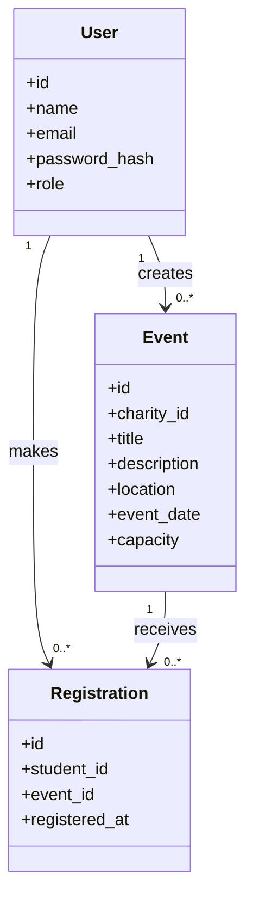

# VolunteerConnect Architecture

```mermaid
classDiagram
    class User {
      +id
      +name
      +email
      +password_hash
      +role
    }
    class Event {
      +id
      +charity_id
      +title
      +description
      +location
      +event_date
      +capacity
    }
    class Registration {
      +id
      +student_id
      +event_id
      +registered_at
    }
    User "1" --> "0..*" Event : creates
    User "1" --> "0..*" Registration : makes
    Event "1" --> "0..*" Registration : receives
```
