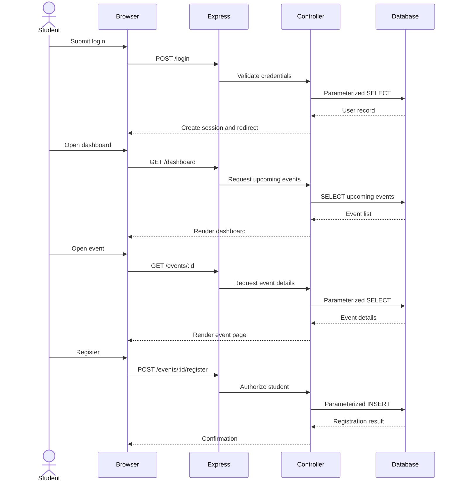

# VolunteerConnect

VolunteerConnect is a web-based Community Volunteer Board prototype developed for the Startup Studio final project.

The application connects university students with local charities. Charity users can create volunteering opportunities, while students can browse available opportunities and register for suitable volunteer shifts.

The prototype deliberately follows the assessment scope limit of:

- **Maximum 3 core screens**
- **Maximum 3 database entities**

---

## 1. Problem

Local charities need a simple way to advertise volunteer opportunities, while university students need an easy place to discover suitable opportunities and register for available shifts.

VolunteerConnect supports two user roles:

### Student

Students can:

- Create an account
- Log in
- Browse upcoming volunteer opportunities
- View event details
- Register for volunteer shifts

### Charity

Charity users can:

- Create an account
- Log in
- Create volunteer events
- View their own events
- View registrations for their own events

The goal is to provide a small, secure and functional prototype rather than a large-scale social platform.

---

## 2. Scope

### Core screens

The system uses exactly three core screens:

1. **Authentication** — login and registration
2. **Dashboard** — student event browsing or charity event management
3. **Event Details** — event information, registration and charity registration view

### Database entities

The application uses exactly three database entities:

1. `users`
2. `events`
3. `registrations`

No additional database entities are required for the prototype.

---

## 3. Technology Stack

VolunteerConnect uses:

- Node.js
- Express.js
- EJS
- SQLite
- `better-sqlite3`
- `express-session`
- `bcryptjs`
- `helmet`
- `express-validator`
- Jest
- Supertest
- Git
- GitHub

---

## 4. System Architecture

VolunteerConnect follows a lightweight MVC-style architecture.

```text
Browser / EJS Views
        |
        | HTTP Requests
        v
Express Routes
        |
        v
Controllers
        |
        v
Models
        |
        v
SQLite Database
```

### Architecture responsibilities

**Views** display authentication forms, dashboards, event details and registration information.

**Routes** receive HTTP requests and direct them to the appropriate controller.

**Controllers** contain application logic for authentication, dashboards, event creation, event details and registration.

**Models** handle database operations using parameterized SQL queries.

**SQLite** stores the three application entities: users, events and registrations.

---

## 5. UML Sequence Diagram

The following sequence diagram shows the main student workflow.



---

## 6. Database Design

### Users

| Field | Description |
|---|---|
| `id` | Primary key |
| `name` | User display name |
| `email` | Unique login email |
| `password_hash` | bcrypt password hash |
| `role` | `student` or `charity` |
| `created_at` | Account creation timestamp |

### Events

| Field | Description |
|---|---|
| `id` | Primary key |
| `charity_id` | Foreign key to the charity user |
| `title` | Event title |
| `description` | Event description |
| `location` | Event location |
| `event_date` | Event date and time |
| `capacity` | Maximum number of volunteers |
| `created_at` | Event creation timestamp |

### Registrations

| Field | Description |
|---|---|
| `id` | Primary key |
| `student_id` | Foreign key to the student user |
| `event_id` | Foreign key to the event |
| `registered_at` | Registration timestamp |

The database uses a unique constraint on `(student_id, event_id)` to prevent duplicate registrations.

---

## 7. Security Audit — SQL Injection

Security auditing was an important part of this project because AI-assisted code must be manually reviewed for vulnerabilities, particularly SQL Injection.

### Vulnerable pattern

An unsafe implementation would concatenate user input directly into a SQL query:

```javascript
const query = "SELECT * FROM users WHERE email = '" + email + "'";
const user = db.prepare(query).get();
```

An attacker could attempt SQL-like input such as:

```text
' OR 1=1 --
```

If input is concatenated into the SQL statement, it could change the meaning of the query.

### Secure implementation

VolunteerConnect uses parameterized queries instead:

```javascript
const user = db.prepare(
  'SELECT id, name, email, password_hash, role FROM users WHERE email = ?'
).get(email);
```

The `?` placeholder separates the SQL statement from the user-supplied data.

The same pattern is used for user IDs, event IDs, charity IDs, student IDs and registration values.

Examples include:

```javascript
db.prepare(
  'INSERT INTO users (name, email, password_hash, role) VALUES (?, ?, ?, ?)'
).run(name, email, passwordHash, role);
```

```javascript
db.prepare(
  'SELECT id FROM registrations WHERE student_id = ? AND event_id = ?'
).get(studentId, eventId);
```

```javascript
db.prepare(
  'INSERT INTO registrations (student_id, event_id) VALUES (?, ?)'
).run(studentId, eventId);
```

This reduces SQL Injection risk because user-controlled values are treated as data rather than executable SQL.

---

## 8. Additional Security Controls

VolunteerConnect also includes:

- Password hashing with bcrypt
- Session-based authentication
- Session regeneration after successful authentication
- `httpOnly` cookies
- `sameSite: 'lax'` cookie protection
- `secure` cookies in production
- Helmet HTTP security headers
- Server-side validation with `express-validator`
- Server-side role-based authorization
- Database foreign keys
- Duplicate-registration prevention
- Event capacity checks
- Rejection of invalid event IDs
- EJS output escaping

Passwords are hashed before storage using bcrypt.

```javascript
const passwordHash = await bcrypt.hash(req.body.password, 12);
```

---

## 9. Mandatory AI Auditing

Generative AI was used as a development assistant for:

- Brainstorming
- Architecture suggestions
- Boilerplate code
- Debugging suggestions
- Security review ideas
- Test case suggestions
- Documentation structure

AI-generated code was not treated as automatically correct.

The manual review process was:

```text
AI suggestion
     |
     v
Manual code review
     |
     +--> Functional correctness
     +--> SQL Injection review
     +--> Authentication review
     +--> Authorization review
     +--> Input validation review
     +--> Privacy review
     +--> Maintainability review
     |
     v
Testing
     |
     v
Correction if required
     |
     v
Approved implementation
     |
     v
Git commit
```

The developer remained responsible for the final architecture, security, testing, debugging, ethics and implementation decisions.

---

## 10. Example of AI Audit in Practice

During manual testing, a dashboard redirect-loop defect was identified.

Authenticated users were redirected to `/dashboard`, but the dashboard route had initially been placed incorrectly inside the event router.

The routing configuration was corrected by defining the dashboard route at the application level.

After the fix, regression tests were added for both student and charity dashboard access.

This demonstrates why AI-generated or initially generated code must be manually reviewed and tested before being accepted.

---

## 11. Social Responsibility and ACM Code of Ethics

VolunteerConnect was designed using privacy and responsible software engineering principles.

### Data minimisation

The application only collects information required for the prototype:

- Name
- Email
- Password hash
- Account role

It does not intentionally collect unnecessary information such as home addresses, government identification, date of birth, continuous location data or unrelated demographic information.

### Responsible data use

Volunteer information is used only for operating the Community Volunteer Board.

The prototype does not sell user information, use it for targeted advertising or intentionally exploit user data.

### Privacy and access control

Students can register for events but cannot create charity events.

Charities can create events and view registrations associated with their own events.

### Fairness

The prototype does not use automated profiling or ranking to discriminate between students.

### Professional responsibility

The developer remains responsible for manually reviewing AI-generated suggestions rather than delegating engineering judgement to an AI system.

These decisions align with ACM Code of Ethics principles relating to avoiding harm, fairness, privacy, confidentiality, security and professional responsibility.

---

## 12. Testing

Run the automated test suite with:

```bash
npm test
```

Final test result:

```text
Test Suites: 1 passed, 1 total
Tests:       10 passed, 10 total
```

The tests cover:

1. Student registration and session creation
2. Invalid email rejection
3. Incorrect login credential rejection
4. Student dashboard access without redirect loop
5. Charity dashboard access without redirect loop
6. Unauthenticated dashboard protection
7. Student restriction from event creation
8. Charity event creation
9. Student registration and duplicate prevention
10. SQL Injection-safe parameter handling

### SQL Injection test

The test suite includes SQL-like input:

```javascript
const maliciousEmail = "' OR 1=1 --";
```

The input is passed through a parameterized query:

```javascript
const result = db.prepare(`
  SELECT *
  FROM users
  WHERE email = ?
`).get(maliciousEmail);
```

The expected result is:

```javascript
expect(result).toBeUndefined();
```

This confirms that SQL-like input is treated as data rather than executable SQL.

---

## 13. Installation

### Requirements

- Node.js 20 or later
- Node.js 22 LTS recommended
- npm

### Clone the repository

```bash
git clone https://github.com/AkilaChamod/VolunteerConnect.git
cd VolunteerConnect
```

### Install dependencies

```bash
npm install
```

### Run tests

```bash
npm test
```

### Start the application

```bash
npm start
```

Open:

```text
http://localhost:3000
```

Development mode:

```bash
npm run dev
```

---

## 14. Environment and Secrets

For production use, set a strong `SESSION_SECRET` environment variable.

Production secrets must never be committed to GitHub.

The `.gitignore` excludes:

```text
node_modules/
database/*.db
.env
.DS_Store
```

---

## 15. Demonstration Flow

### Charity workflow

1. Register or log in as a charity.
2. Open the charity dashboard.
3. Create a volunteer event.
4. Enter a title, description, location, future date/time and capacity.
5. Publish the event.
6. Open the event details page.
7. Confirm the registration count.

### Student workflow

1. Log out.
2. Register or log in as a student.
3. Open the student dashboard.
4. Browse available volunteer opportunities.
5. Open an event.
6. Register for the event.
7. Confirm successful registration.

### Charity registration view

1. Log out from the student account.
2. Log back in as the charity.
3. Open the same event.
4. Confirm the registered student appears.
5. Confirm the registration count has increased.

---

## 16. AI Usage Declaration

Generative AI was used as a development assistant during the project.

AI-assisted activities included brainstorming, code suggestions, debugging, documentation suggestions, test design and security review ideas.

AI-generated output was manually reviewed, tested and corrected where necessary.

The final responsibility for the code, architecture, security, testing and ethical decisions remains with the developer.

---

## 17. Limitations

VolunteerConnect is intentionally a prototype rather than a production-scale volunteer management system.

Current limitations include:

- No password reset
- No email verification
- No charity verification
- No notification system
- No advanced search
- No calendar integration
- No production-grade session store
- No deployment infrastructure
- No audit logging

These features were intentionally excluded to maintain the required assessment scope.

---

## 18. Future Improvements

Potential future improvements include:

- Email notifications
- Password recovery
- Verified charity accounts
- Search and filtering
- Calendar integration
- Accessibility testing
- Production-grade session storage
- Automated security scanning
- CI/CD
- Audit logging
- Event cancellation support

---

## 19. References

- OWASP Foundation, **SQL Injection Prevention Cheat Sheet**: https://cheatsheetseries.owasp.org/cheatsheets/SQL_Injection_Prevention_Cheat_Sheet.html
- OWASP Foundation, **Secure Code Review Cheat Sheet**: https://cheatsheetseries.owasp.org/cheatsheets/Secure_Code_Review_Cheat_Sheet.html
- Association for Computing Machinery, **ACM Code of Ethics and Professional Conduct**: https://www.acm.org/code-of-ethics

---

## 20. Final Project Summary

VolunteerConnect demonstrates a complete Community Volunteer Board workflow while remaining within the assessment scope.

The project includes:

- Three core screens
- Three database entities
- Student and charity roles
- Secure authentication
- Role-based authorization
- Volunteer event creation
- Student event registration
- Duplicate registration prevention
- SQLite persistence
- Parameterized SQL queries
- SQL Injection auditing
- Manual AI code review
- Automated testing
- ACM-aligned social responsibility
- GitHub version control

The project prioritises security, maintainability, testing and ethical responsibility over unnecessary feature complexity.
