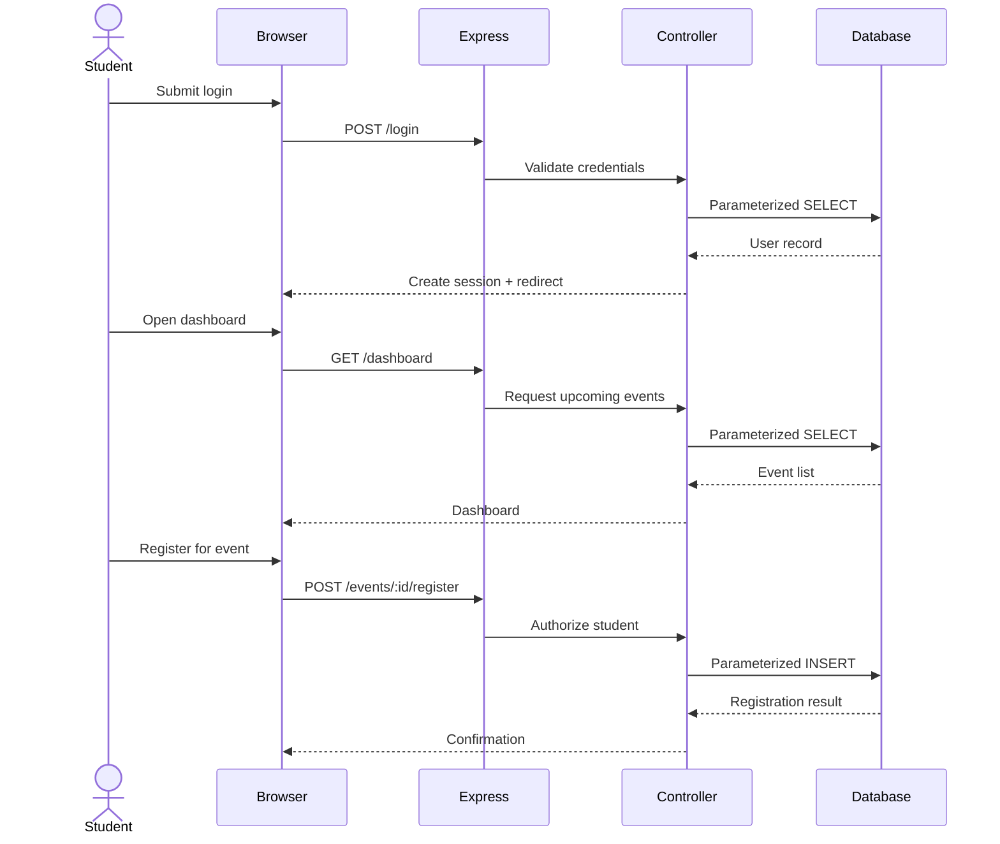

# VolunteerConnect

VolunteerConnect is a small web-based Community Volunteer Board prototype developed for the Startup Studio final project.

## 1. Problem

Local charities need a simple way to advertise upcoming volunteer opportunities, while university students need a central place to discover suitable volunteer shifts and register for them.

VolunteerConnect addresses this problem with two roles:

- **Student** — browse upcoming opportunities and register for a volunteer event.
- **Charity** — publish volunteer opportunities and view student registrations for its own events.

The prototype intentionally follows the assessment scope limit of **three core screens** and **three database entities**.

## 2. Scope

### Core screens

1. **Authentication** — login and registration.
2. **Dashboard** — student event browsing or charity event management.
3. **Event Details** — event information, registration and charity registration view.

### Database entities

1. `users`
2. `events`
3. `registrations`

No additional database entities are required for the prototype.

## 3. Technology Stack

- Node.js
- Express.js
- EJS
- SQLite via `better-sqlite3`
- `express-session`
- `bcryptjs`
- `helmet`
- `express-validator`
- Jest
- Supertest

## 4. System Architecture

The application follows a lightweight MVC architecture.

```text
Browser
   |
   | HTTP requests
   v
Express Routes
   |
   v
Controllers
   |
   v
Models
   |
   v
SQLite Database
```

### Sequence diagram



## 5. Database Design

### Users

| Field | Description |
|---|---|
| id | Primary key |
| name | User display name |
| email | Unique login email |
| password_hash | bcrypt password hash |
| role | `student` or `charity` |
| created_at | Account creation timestamp |

### Events

| Field | Description |
|---|---|
| id | Primary key |
| charity_id | Foreign key to users |
| title | Event title |
| description | Event description |
| location | Event location |
| event_date | Event date/time |
| capacity | Maximum volunteer places |
| created_at | Creation timestamp |

### Registrations

| Field | Description |
|---|---|
| id | Primary key |
| student_id | Foreign key to users |
| event_id | Foreign key to events |
| registered_at | Registration timestamp |

A unique constraint on `(student_id, event_id)` prevents duplicate registrations.

## 6. Security Audit — SQL Injection

### Assessment requirement

AI-assisted development creates a risk that generated code may contain insecure database queries. All database operations in this prototype were manually reviewed before being accepted.

### Vulnerability considered

A vulnerable pattern would concatenate untrusted input into SQL:

```javascript
const query = "SELECT * FROM users WHERE email = '" + email + "'";
db.prepare(query).get();
```

This approach can allow user-controlled input to alter the intended SQL statement.

### Corrected implementation

VolunteerConnect uses parameterized queries:

```javascript
const user = db.prepare(
  'SELECT id, name, email, password_hash, role FROM users WHERE email = ?'
).get(email);
```

The user-controlled email is supplied separately as a parameter rather than being inserted into the SQL command.

The same approach is used for event IDs, user IDs and registration values.

### Additional security controls

- Passwords are hashed using bcrypt.
- Authentication is session-based.
- Session cookies use `httpOnly` and `sameSite` controls.
- Production cookies use the `secure` flag.
- Helmet provides common HTTP security headers.
- Express-validator performs server-side validation.
- Role-based authorization is enforced on the server.
- Database foreign keys are enabled.
- Duplicate registrations are prevented by a database constraint.
- Event capacity is checked before registration.
- Unknown event IDs are rejected.
- User input is rendered through EJS escaping rather than raw HTML output.

### Security testing

The test suite includes a SQL-like input test:

```javascript
const maliciousEmail = "' OR 1=1 --";
const result = db.prepare(
  'SELECT * FROM users WHERE email = ?'
).get(maliciousEmail);

expect(result).toBeUndefined();
```

This confirms that the input is treated as data rather than executable SQL.

OWASP recommends prepared statements with parameterized queries as a primary defence against SQL injection and recommends checking database calls during secure code review. See the official OWASP SQL Injection Prevention Cheat Sheet and Secure Code Review Cheat Sheet.

## 7. Mandatory AI Auditing

Generative AI was used as a development assistant for ideas, boilerplate and code suggestions. The developer remained responsible for the final architecture, security and implementation.

The review process was:

```text
AI suggestion
     |
     v
Manual code review
     |
     +--> Functional correctness
     |
     +--> SQL injection review
     |
     +--> Authentication review
     |
     +--> Authorization review
     |
     +--> Input validation review
     |
     +--> Privacy/ethics review
     |
     v
Testing
     |
     v
Approved implementation
     |
     v
Git commit
```

AI-generated code was not treated as automatically trustworthy or production-ready.

## 8. Social Responsibility and ACM Code of Ethics

VolunteerConnect is designed to support responsible software engineering.

### Privacy

The application collects only information necessary to operate the prototype:

- Name
- Email
- Password hash
- Account role

The system does not intentionally collect unnecessary information such as home address, government identification, date of birth, continuous location information or unrelated demographic data.

### Data use

Volunteer information is used only for connecting students with volunteer opportunities and allowing charities to manage registrations. The prototype does not sell volunteer information, use it for targeted advertising or intentionally exploit user data.

### Access control

Students can register for opportunities but cannot create charity events. Charities can create events and view registrations belonging to their own events. They cannot access another charity's private registration information through the application interface.

### Fairness and inclusion

The prototype does not use automated profiling or ranking to discriminate between students. Opportunities are presented using straightforward event information.

### Professional responsibility

The implementation prioritises security, privacy, maintainability and transparency. The developer remains responsible for reviewing AI-generated suggestions rather than delegating engineering judgement to an AI system.

These decisions align with ACM principles concerning avoiding harm, fairness, privacy, confidentiality and professional responsibility.

## 9. Testing

Run:

```bash
npm test
```

The automated tests cover:

- Student registration
- Invalid registration input
- Invalid login credentials
- Authentication protection
- Role authorization
- Charity event creation
- Student registration
- Duplicate registration prevention
- SQL injection-safe parameter handling

## 10. Installation

### Requirements

- Node.js 20 or later
- npm

### Install

```bash
npm install
```

### Start

```bash
npm start
```

Or development mode:

```bash
npm run dev
```

Open `http://localhost:3000`.

### Production session secret

Set a strong `SESSION_SECRET` environment variable before deployment. Never commit a production secret to GitHub.

## 11. Demonstration flow

1. Create a charity account.
2. Create a volunteer event.
3. Log out.
4. Create a student account.
5. Browse the event.
6. Register.
7. Return to the charity account.
8. Open the event and show the registration.
9. Briefly demonstrate the parameterized SQL query during the security section.

Do not use real personal passwords or sensitive information in the demonstration.

## 12. AI Usage Declaration

Generative AI tools may be used during development to assist with brainstorming, boilerplate code, debugging suggestions, documentation suggestions and test-case ideas. Generated output must be manually reviewed, tested and adapted before inclusion in the final repository.

The developer is responsible for the final code, architecture, security controls and ethical decisions.

## 13. Limitations and Future Improvements

This is intentionally a prototype and not a production-scale volunteer management platform.

Potential future improvements include email notifications, password reset, charity verification, advanced search, calendar integration, accessibility testing, production-grade session storage, audit logging and CI security scanning. These are intentionally outside the current prototype scope.

## 14. References

- OWASP Foundation, *SQL Injection Prevention Cheat Sheet* — https://cheatsheetseries.owasp.org/cheatsheets/SQL_Injection_Prevention_Cheat_Sheet.html
- OWASP Foundation, *Secure Code Review Cheat Sheet* — https://cheatsheetseries.owasp.org/cheatsheets/Secure_Code_Review_Cheat_Sheet.html
- Association for Computing Machinery, *ACM Code of Ethics and Professional Conduct* — https://www.acm.org/binaries/content/assets/about/acm-code-of-ethics-and-professional-conduct.pdf
